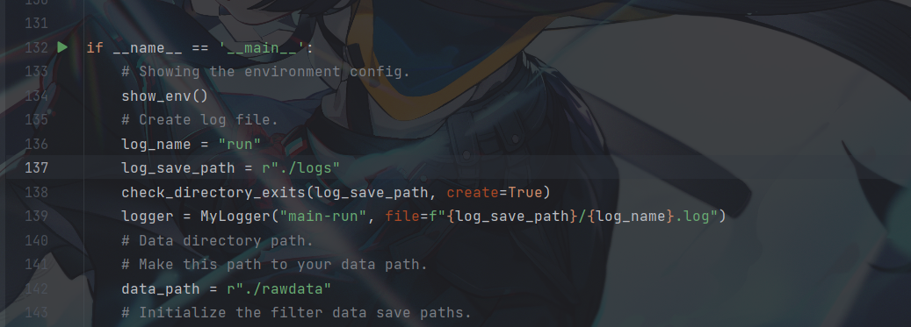
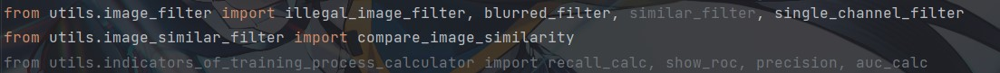

# Computer vision applications

[//]: # (_项目名称_)

## __猫狗分类__

基于tensorflow搭建的二分类模型，训练后的模型有足够的能力识别非训练测试集中的数据样本。

* 数据筛选

    包括模糊图片，损坏图片，单通道图片，相似图片。    

* 数据增强
        
    包括图像的翻转，图像的旋转，图像的二值化，图像的缩放，图像的虚化

* 模型构建

    构建序列化模型

* 模型保存
* 日志保存

_快速上手_

首先运行.\utils\show_environment_config.py文件，用来检测当前环境是否有这个项目所需要的包
如果包名不存在，则使用以下命令安装所需的库包：

        pip install -r ./requirements.txt

这个项目不包含训练数据集，需要自己添加，方法如下：

    # Data directory path.
    # Make this path to your data path.
    data_path = r"./rawdata"

如果你的数据样本不是这样的

        data_path/cats/cat.0.jpg
        data_path/cats/cat.1.jpg
        or
        data_path/dogs/dog.0.jpg
        data_path/dogs/dog.1.jpg

在file_rename.py文件中修改以下内容并运行，以获得这个项目训练样本需要的格式

    PATH = r"your/data/path"

### 注意

这个项目不应包含在任何有中文字符的路径中

_Run_
* 模型训练：

参照安装说明添加数据路径后运行main.py文件

* 模型预测：

将image_path换成自己添加的文件路径，将model_path换成生成模型的路径，运行test_model.py文件。

        image_path = r"./test_model_data/test2.jpg"
        model_path = r".\models\2023-05-25 06-15-57_debug.h5"

## 备注：
* 当项目运行出现问题时，查看requirements.txt文件中库对应的版本，按照安装说明进行安装。
* 运行过程中的详细信息可在./logs/run.log查看。
* 您可能注意到在项目中有一些库是灰色的

    像这样

  

  其中similar_filter我使用了compare_image_similarity来代替它，因为在我测试大型数据时它会消耗很长的时间，所以我换了一个相似度比较方法

  另外的模型评估的指标如recall，roc，precision等有我无法解决的问题，所以我暂时把它搁置:D